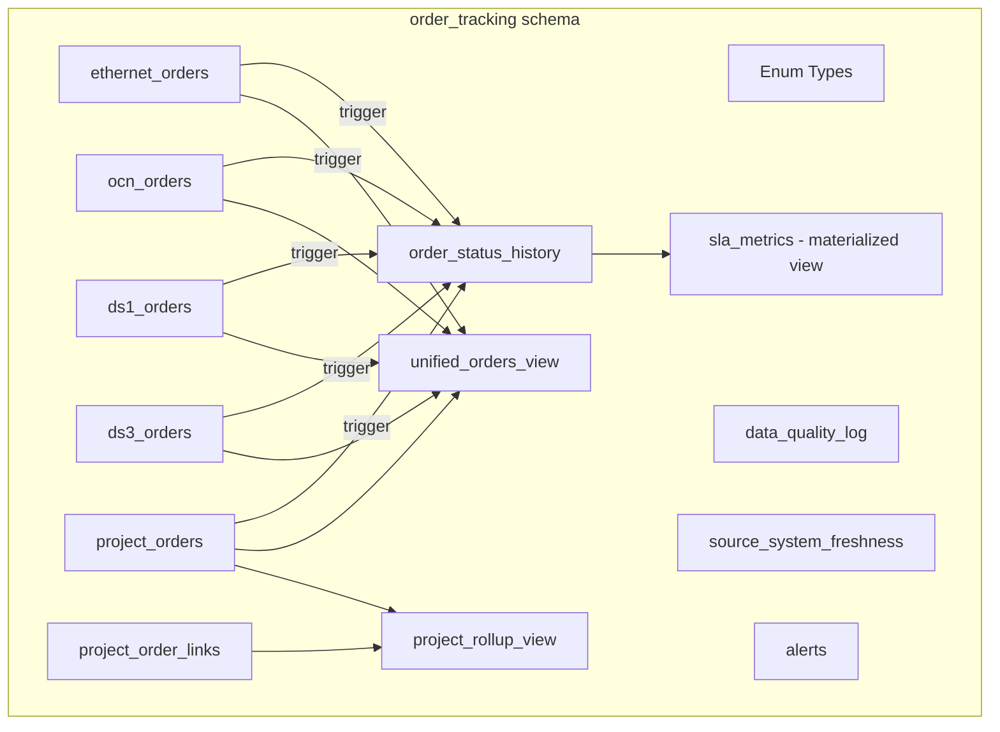
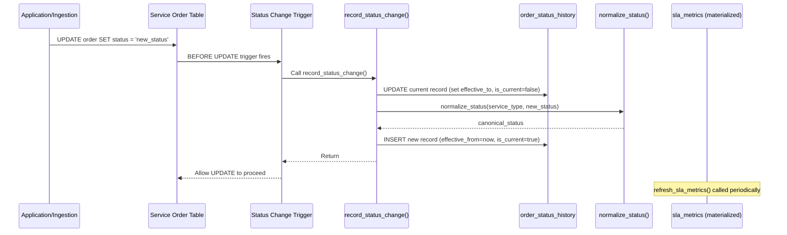
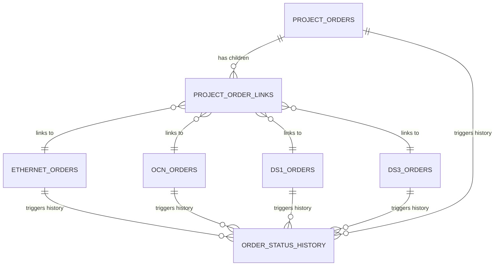

# Design Document: Order Tracking System

## Overview

The Order Tracking System is a Supabase Postgres database layer that unifies telecom service order data across five service types (Ethernet, OCN, DS1, DS3, Project Management) into a single queryable platform. The system uses a dedicated `order_tracking` schema with UUID surrogate keys, TEXT business keys, SCD Type 2 history tracking via triggers, materialized views for SLA metrics, and Row Level Security for role-based access control.

All schema objects live in the `order_tracking` schema to avoid polluting the public schema. Migrations are applied sequentially via the Supabase CLI.

## Architecture



## Main Workflow: Status Change Processing



## Components and Interfaces

### Component 1: Schema and Enum Types

All enum types are created in the `order_tracking` schema. They enforce data integrity at the Postgres type level.

```sql
-- Schema creation
CREATE SCHEMA IF NOT EXISTS order_tracking;

-- Service type enum
CREATE TYPE order_tracking.service_type AS ENUM (
  'ethernet', 'ocn', 'ds1', 'ds3', 'project_management'
);

-- Canonical status (unified taxonomy)
CREATE TYPE order_tracking.canonical_order_status AS ENUM (
  'RECEIVED', 'DESIGN', 'IN_PROGRESS', 'TESTING',
  'COMPLETE', 'ON_HOLD', 'CANCELLED'
);

-- Service-specific status enums
CREATE TYPE order_tracking.ethernet_order_status AS ENUM (
  'Submitted', 'In Design', 'Provisioning', 'Testing', 'Complete', 'Cancelled'
);

CREATE TYPE order_tracking.ocn_order_status AS ENUM (
  'Submitted', 'Engineering', 'Provisioning', 'Turn-Up', 'Testing', 'Complete', 'Cancelled'
);

CREATE TYPE order_tracking.ds1_ds3_order_status AS ENUM (
  'Submitted', 'Facility Assignment', 'Provisioning', 'Testing', 'Complete', 'Cancelled'
);

CREATE TYPE order_tracking.project_status AS ENUM (
  'Initiated', 'Planning', 'In Progress', 'UAT', 'Complete', 'On Hold', 'Cancelled'
);

-- Order type enum
CREATE TYPE order_tracking.order_type AS ENUM (
  'New', 'Change', 'Disconnect', 'Upgrade'
);

-- Ethernet-specific enums
CREATE TYPE order_tracking.ethernet_service_subtype AS ENUM (
  'E-Line', 'E-LAN', 'E-Tree', 'Metro Ethernet'
);

CREATE TYPE order_tracking.port_speed AS ENUM (
  '10M', '100M', '1G', '10G', '100G'
);

CREATE TYPE order_tracking.cos_profile AS ENUM (
  'Real-Time', 'Business Critical', 'Standard'
);

-- OCN-specific enums
CREATE TYPE order_tracking.ocn_rate AS ENUM (
  'OC-3', 'OC-12', 'OC-48', 'OC-192'
);

CREATE TYPE order_tracking.protection_type AS ENUM (
  'UPSR', 'BLSR', '1+1', 'Unprotected'
);

-- DS1-specific enums
CREATE TYPE order_tracking.ds1_framing_type AS ENUM ('ESF', 'D4');
CREATE TYPE order_tracking.line_coding AS ENUM ('AMI', 'B8ZS');
CREATE TYPE order_tracking.ds1_channelization AS ENUM ('Channelized', 'Unchannelized');

-- DS3-specific enums
CREATE TYPE order_tracking.ds3_framing_type AS ENUM ('C-Bit', 'M13');
CREATE TYPE order_tracking.ds3_channel_config AS ENUM ('Clear Channel', 'Channelized');

-- Project Management enums
CREATE TYPE order_tracking.project_type AS ENUM (
  'Multi-Site', 'Complex Build', 'Migration', 'Custom'
);

CREATE TYPE order_tracking.priority_level AS ENUM (
  'Critical', 'High', 'Medium', 'Low'
);

-- Alert enums
CREATE TYPE order_tracking.alert_type AS ENUM (
  'sla_breach_risk', 'stuck_order', 'data_freshness_degradation', 'pipeline_failure'
);

CREATE TYPE order_tracking.severity_level AS ENUM (
  'critical', 'high', 'medium', 'low'
);
```

### Component 2: Service Order Tables

Each table uses UUID surrogate keys (`id`) and TEXT business keys (`order_id`, `project_id`, `circuit_id`). All timestamps use `timestamptz`.

```sql
-- Ethernet Orders
CREATE TABLE order_tracking.ethernet_orders (
  id            UUID PRIMARY KEY DEFAULT gen_random_uuid(),
  order_id      TEXT NOT NULL UNIQUE,
  order_type    order_tracking.order_type NOT NULL,
  service_subtype order_tracking.ethernet_service_subtype,
  bandwidth_mbps INTEGER CHECK (bandwidth_mbps > 0),
  port_speed    order_tracking.port_speed,
  vlan_id       INTEGER CHECK (vlan_id BETWEEN 1 AND 4094),
  a_location_clli TEXT,
  z_location_clli TEXT,
  cos_profile   order_tracking.cos_profile,
  customer_id   TEXT NOT NULL,
  order_status  order_tracking.ethernet_order_status NOT NULL,
  requested_due_date  TIMESTAMPTZ,
  committed_due_date  TIMESTAMPTZ,
  actual_completion_date TIMESTAMPTZ,
  created_at    TIMESTAMPTZ NOT NULL DEFAULT now(),
  updated_at    TIMESTAMPTZ NOT NULL DEFAULT now(),
  CONSTRAINT chk_ethernet_dates_after_created
    CHECK (requested_due_date IS NULL OR requested_due_date >= created_at),
  CONSTRAINT chk_ethernet_committed_after_created
    CHECK (committed_due_date IS NULL OR committed_due_date >= created_at),
  CONSTRAINT chk_ethernet_completion_after_created
    CHECK (actual_completion_date IS NULL OR actual_completion_date >= created_at)
);

-- OCN Orders
CREATE TABLE order_tracking.ocn_orders (
  id            UUID PRIMARY KEY DEFAULT gen_random_uuid(),
  order_id      TEXT NOT NULL UNIQUE,
  order_type    order_tracking.order_type NOT NULL,
  ocn_rate      order_tracking.ocn_rate,
  circuit_id    TEXT,
  ring_id       TEXT,
  protection_type order_tracking.protection_type,
  a_location_clli TEXT,
  z_location_clli TEXT,
  customer_id   TEXT NOT NULL,
  order_status  order_tracking.ocn_order_status NOT NULL,
  requested_due_date  TIMESTAMPTZ,
  committed_due_date  TIMESTAMPTZ,
  actual_completion_date TIMESTAMPTZ,
  created_at    TIMESTAMPTZ NOT NULL DEFAULT now(),
  updated_at    TIMESTAMPTZ NOT NULL DEFAULT now(),
  CONSTRAINT chk_ocn_dates_after_created
    CHECK (requested_due_date IS NULL OR requested_due_date >= created_at),
  CONSTRAINT chk_ocn_committed_after_created
    CHECK (committed_due_date IS NULL OR committed_due_date >= created_at),
  CONSTRAINT chk_ocn_completion_after_created
    CHECK (actual_completion_date IS NULL OR actual_completion_date >= created_at)
);

-- DS1 Orders
CREATE TABLE order_tracking.ds1_orders (
  id            UUID PRIMARY KEY DEFAULT gen_random_uuid(),
  order_id      TEXT NOT NULL UNIQUE,
  order_type    order_tracking.order_type NOT NULL,
  circuit_id    TEXT,
  framing_type  order_tracking.ds1_framing_type,
  line_coding   order_tracking.line_coding,
  channelization order_tracking.ds1_channelization,
  a_location_clli TEXT,
  z_location_clli TEXT,
  customer_id   TEXT NOT NULL,
  order_status  order_tracking.ds1_ds3_order_status NOT NULL,
  requested_due_date  TIMESTAMPTZ,
  committed_due_date  TIMESTAMPTZ,
  actual_completion_date TIMESTAMPTZ,
  created_at    TIMESTAMPTZ NOT NULL DEFAULT now(),
  updated_at    TIMESTAMPTZ NOT NULL DEFAULT now(),
  CONSTRAINT chk_ds1_dates_after_created
    CHECK (requested_due_date IS NULL OR requested_due_date >= created_at),
  CONSTRAINT chk_ds1_committed_after_created
    CHECK (committed_due_date IS NULL OR committed_due_date >= created_at),
  CONSTRAINT chk_ds1_completion_after_created
    CHECK (actual_completion_date IS NULL OR actual_completion_date >= created_at)
);

-- DS3 Orders
CREATE TABLE order_tracking.ds3_orders (
  id            UUID PRIMARY KEY DEFAULT gen_random_uuid(),
  order_id      TEXT NOT NULL UNIQUE,
  order_type    order_tracking.order_type NOT NULL,
  circuit_id    TEXT,
  framing_type  order_tracking.ds3_framing_type,
  channel_config order_tracking.ds3_channel_config,
  a_location_clli TEXT,
  z_location_clli TEXT,
  customer_id   TEXT NOT NULL,
  order_status  order_tracking.ds1_ds3_order_status NOT NULL,
  requested_due_date  TIMESTAMPTZ,
  committed_due_date  TIMESTAMPTZ,
  actual_completion_date TIMESTAMPTZ,
  created_at    TIMESTAMPTZ NOT NULL DEFAULT now(),
  updated_at    TIMESTAMPTZ NOT NULL DEFAULT now(),
  CONSTRAINT chk_ds3_dates_after_created
    CHECK (requested_due_date IS NULL OR requested_due_date >= created_at),
  CONSTRAINT chk_ds3_committed_after_created
    CHECK (committed_due_date IS NULL OR committed_due_date >= created_at),
  CONSTRAINT chk_ds3_completion_after_created
    CHECK (actual_completion_date IS NULL OR actual_completion_date >= created_at)
);

-- Project Orders
CREATE TABLE order_tracking.project_orders (
  id            UUID PRIMARY KEY DEFAULT gen_random_uuid(),
  project_id    TEXT NOT NULL UNIQUE,
  project_name  TEXT,
  project_type  order_tracking.project_type,
  project_manager_id TEXT,
  customer_id   TEXT NOT NULL,
  total_sites   INTEGER DEFAULT 0,
  sites_completed INTEGER DEFAULT 0,
  project_status order_tracking.project_status NOT NULL,
  priority      order_tracking.priority_level,
  requested_due_date  TIMESTAMPTZ,
  committed_due_date  TIMESTAMPTZ,
  actual_completion_date TIMESTAMPTZ,
  created_at    TIMESTAMPTZ NOT NULL DEFAULT now(),
  updated_at    TIMESTAMPTZ NOT NULL DEFAULT now(),
  CONSTRAINT chk_project_sites
    CHECK (sites_completed <= total_sites),
  CONSTRAINT chk_project_dates_after_created
    CHECK (requested_due_date IS NULL OR requested_due_date >= created_at),
  CONSTRAINT chk_project_committed_after_created
    CHECK (committed_due_date IS NULL OR committed_due_date >= created_at),
  CONSTRAINT chk_project_completion_after_created
    CHECK (actual_completion_date IS NULL OR actual_completion_date >= created_at)
);
```

### Component 3: Project Order Links (M:N Junction)

```sql
CREATE TABLE order_tracking.project_order_links (
  id            UUID PRIMARY KEY DEFAULT gen_random_uuid(),
  project_id    TEXT NOT NULL REFERENCES order_tracking.project_orders(project_id),
  service_type  order_tracking.service_type NOT NULL,
  order_id      TEXT NOT NULL,
  linked_at     TIMESTAMPTZ NOT NULL DEFAULT now(),
  CONSTRAINT uq_project_order_link UNIQUE (project_id, service_type, order_id)
);
```

### Component 4: Order Status History (SCD Type 2)

```sql
CREATE TABLE order_tracking.order_status_history (
  id              UUID PRIMARY KEY DEFAULT gen_random_uuid(),
  service_type    order_tracking.service_type NOT NULL,
  order_id        TEXT NOT NULL,
  previous_status TEXT,
  new_status      TEXT NOT NULL,
  canonical_status order_tracking.canonical_order_status,
  changed_at      TIMESTAMPTZ NOT NULL DEFAULT now(),
  changed_by      TEXT,
  effective_from  TIMESTAMPTZ NOT NULL DEFAULT now(),
  effective_to    TIMESTAMPTZ,
  is_current      BOOLEAN NOT NULL DEFAULT true
);
```

### Component 5: Data Quality and Alerting Tables

```sql
CREATE TABLE order_tracking.data_quality_log (
  id              UUID PRIMARY KEY DEFAULT gen_random_uuid(),
  service_type    order_tracking.service_type,
  order_id        TEXT,
  field_name      TEXT NOT NULL,
  violation_type  TEXT NOT NULL,
  violation_detail TEXT,
  detected_at     TIMESTAMPTZ NOT NULL DEFAULT now()
);

CREATE TABLE order_tracking.source_system_freshness (
  id              UUID PRIMARY KEY DEFAULT gen_random_uuid(),
  source_system   TEXT NOT NULL UNIQUE,
  last_sync_timestamp TIMESTAMPTZ,
  expected_interval_minutes INTEGER NOT NULL,
  is_stale        BOOLEAN NOT NULL DEFAULT false,
  checked_at      TIMESTAMPTZ NOT NULL DEFAULT now()
);

CREATE TABLE order_tracking.alerts (
  id              UUID PRIMARY KEY DEFAULT gen_random_uuid(),
  alert_type      order_tracking.alert_type NOT NULL,
  service_type    order_tracking.service_type,
  order_id        TEXT,
  severity        order_tracking.severity_level NOT NULL,
  message         TEXT NOT NULL,
  created_at      TIMESTAMPTZ NOT NULL DEFAULT now(),
  acknowledged_at TIMESTAMPTZ,
  acknowledged_by TEXT
);

-- Cycle time targets reference table
CREATE TABLE order_tracking.cycle_time_targets (
  id              UUID PRIMARY KEY DEFAULT gen_random_uuid(),
  service_type    order_tracking.service_type NOT NULL,
  order_type      order_tracking.order_type NOT NULL,
  target_days     INTEGER NOT NULL,
  CONSTRAINT uq_cycle_time_target UNIQUE (service_type, order_type)
);

-- Seed cycle time targets
INSERT INTO order_tracking.cycle_time_targets (service_type, order_type, target_days) VALUES
  ('ethernet', 'New', 30),
  ('ethernet', 'Change', 15),
  ('ocn', 'New', 45),
  ('ocn', 'Change', 20),
  ('ds1', 'New', 10),
  ('ds1', 'Change', 5),
  ('ds3', 'New', 15),
  ('ds3', 'Change', 7);
```

## Data Models

### Entity Relationship Diagram



## Database Functions

### Function 1: normalize_status()

```sql
CREATE OR REPLACE FUNCTION order_tracking.normalize_status(
  p_service_type order_tracking.service_type,
  p_raw_status TEXT
)
RETURNS order_tracking.canonical_order_status
LANGUAGE plpgsql IMMUTABLE
AS $$
BEGIN
  CASE p_service_type
    WHEN 'ethernet' THEN
      CASE p_raw_status
        WHEN 'Submitted' THEN RETURN 'RECEIVED';
        WHEN 'In Design' THEN RETURN 'DESIGN';
        WHEN 'Provisioning' THEN RETURN 'IN_PROGRESS';
        WHEN 'Testing' THEN RETURN 'TESTING';
        WHEN 'Complete' THEN RETURN 'COMPLETE';
        WHEN 'Cancelled' THEN RETURN 'CANCELLED';
        ELSE NULL;
      END CASE;
    WHEN 'ocn' THEN
      CASE p_raw_status
        WHEN 'Submitted' THEN RETURN 'RECEIVED';
        WHEN 'Engineering' THEN RETURN 'DESIGN';
        WHEN 'Provisioning' THEN RETURN 'IN_PROGRESS';
        WHEN 'Turn-Up' THEN RETURN 'TESTING';
        WHEN 'Testing' THEN RETURN 'TESTING';
        WHEN 'Complete' THEN RETURN 'COMPLETE';
        WHEN 'Cancelled' THEN RETURN 'CANCELLED';
        ELSE NULL;
      END CASE;
    WHEN 'ds1', 'ds3' THEN
      CASE p_raw_status
        WHEN 'Submitted' THEN RETURN 'RECEIVED';
        WHEN 'Facility Assignment' THEN RETURN 'DESIGN';
        WHEN 'Provisioning' THEN RETURN 'IN_PROGRESS';
        WHEN 'Testing' THEN RETURN 'TESTING';
        WHEN 'Complete' THEN RETURN 'COMPLETE';
        WHEN 'Cancelled' THEN RETURN 'CANCELLED';
        ELSE NULL;
      END CASE;
    WHEN 'project_management' THEN
      CASE p_raw_status
        WHEN 'Initiated' THEN RETURN 'RECEIVED';
        WHEN 'Planning' THEN RETURN 'DESIGN';
        WHEN 'In Progress' THEN RETURN 'IN_PROGRESS';
        WHEN 'UAT' THEN RETURN 'TESTING';
        WHEN 'Complete' THEN RETURN 'COMPLETE';
        WHEN 'On Hold' THEN RETURN 'ON_HOLD';
        WHEN 'Cancelled' THEN RETURN 'CANCELLED';
        ELSE NULL;
      END CASE;
  END CASE;

  -- Log unrecognized status
  INSERT INTO order_tracking.data_quality_log (service_type, field_name, violation_type, violation_detail)
  VALUES (p_service_type, 'order_status', 'unrecognized_status', p_raw_status);

  RETURN NULL;
END;
$$;
```

### Function 2: calculate_business_days()

```sql
CREATE OR REPLACE FUNCTION order_tracking.calculate_business_days(
  p_start_date TIMESTAMPTZ,
  p_end_date TIMESTAMPTZ
)
RETURNS INTEGER
LANGUAGE plpgsql IMMUTABLE
AS $$
DECLARE
  v_days INTEGER := 0;
  v_current DATE;
BEGIN
  IF p_start_date IS NULL OR p_end_date IS NULL THEN
    RETURN NULL;
  END IF;

  v_current := p_start_date::DATE;
  WHILE v_current < p_end_date::DATE LOOP
    -- Exclude Saturday (6) and Sunday (0)
    IF EXTRACT(DOW FROM v_current) NOT IN (0, 6) THEN
      v_days := v_days + 1;
    END IF;
    v_current := v_current + 1;
  END LOOP;

  RETURN v_days;
END;
$$;
```

### Function 3: calculate_sla_variance()

```sql
CREATE OR REPLACE FUNCTION order_tracking.calculate_sla_variance(
  p_order_id TEXT,
  p_service_type order_tracking.service_type
)
RETURNS INTEGER
LANGUAGE plpgsql STABLE
AS $$
DECLARE
  v_committed TIMESTAMPTZ;
  v_actual TIMESTAMPTZ;
  v_end_date TIMESTAMPTZ;
BEGIN
  -- Fetch dates based on service type
  CASE p_service_type
    WHEN 'ethernet' THEN
      SELECT committed_due_date, actual_completion_date
      INTO v_committed, v_actual
      FROM order_tracking.ethernet_orders WHERE order_id = p_order_id;
    WHEN 'ocn' THEN
      SELECT committed_due_date, actual_completion_date
      INTO v_committed, v_actual
      FROM order_tracking.ocn_orders WHERE order_id = p_order_id;
    WHEN 'ds1' THEN
      SELECT committed_due_date, actual_completion_date
      INTO v_committed, v_actual
      FROM order_tracking.ds1_orders WHERE order_id = p_order_id;
    WHEN 'ds3' THEN
      SELECT committed_due_date, actual_completion_date
      INTO v_committed, v_actual
      FROM order_tracking.ds3_orders WHERE order_id = p_order_id;
    WHEN 'project_management' THEN
      SELECT committed_due_date, actual_completion_date
      INTO v_committed, v_actual
      FROM order_tracking.project_orders WHERE project_id = p_order_id;
  END CASE;

  IF v_committed IS NULL THEN
    RETURN NULL;
  END IF;

  v_end_date := COALESCE(v_actual, now());
  -- Positive = late, Negative = early
  RETURN (v_end_date::DATE - v_committed::DATE);
END;
$$;
```

### Function 4: check_sla_breach_risk()

```sql
CREATE OR REPLACE FUNCTION order_tracking.check_sla_breach_risk(
  p_order_id TEXT,
  p_service_type order_tracking.service_type
)
RETURNS BOOLEAN
LANGUAGE plpgsql STABLE
AS $$
DECLARE
  v_committed TIMESTAMPTZ;
  v_actual TIMESTAMPTZ;
  v_created TIMESTAMPTZ;
  v_target_days INTEGER;
  v_elapsed_days INTEGER;
  v_order_type order_tracking.order_type;
BEGIN
  -- Fetch order details
  CASE p_service_type
    WHEN 'ethernet' THEN
      SELECT committed_due_date, actual_completion_date, created_at, order_type
      INTO v_committed, v_actual, v_created, v_order_type
      FROM order_tracking.ethernet_orders WHERE order_id = p_order_id;
    WHEN 'ocn' THEN
      SELECT committed_due_date, actual_completion_date, created_at, order_type
      INTO v_committed, v_actual, v_created, v_order_type
      FROM order_tracking.ocn_orders WHERE order_id = p_order_id;
    WHEN 'ds1' THEN
      SELECT committed_due_date, actual_completion_date, created_at, order_type
      INTO v_committed, v_actual, v_created, v_order_type
      FROM order_tracking.ds1_orders WHERE order_id = p_order_id;
    WHEN 'ds3' THEN
      SELECT committed_due_date, actual_completion_date, created_at, order_type
      INTO v_committed, v_actual, v_created, v_order_type
      FROM order_tracking.ds3_orders WHERE order_id = p_order_id;
    ELSE
      RETURN FALSE;
  END CASE;

  -- Already completed
  IF v_actual IS NOT NULL THEN
    RETURN FALSE;
  END IF;

  -- Check against committed date
  IF v_committed IS NOT NULL AND now() > v_committed THEN
    RETURN TRUE;
  END IF;

  -- Check against cycle time target
  SELECT target_days INTO v_target_days
  FROM order_tracking.cycle_time_targets
  WHERE service_type = p_service_type AND order_type = v_order_type;

  IF v_target_days IS NOT NULL THEN
    v_elapsed_days := order_tracking.calculate_business_days(v_created, now());
    IF v_elapsed_days > (v_target_days * 0.8) THEN
      RETURN TRUE;  -- At risk if >80% of target consumed
    END IF;
  END IF;

  RETURN FALSE;
END;
$$;
```

### Function 5: record_status_change()

```sql
CREATE OR REPLACE FUNCTION order_tracking.record_status_change(
  p_service_type order_tracking.service_type,
  p_order_id TEXT,
  p_old_status TEXT,
  p_new_status TEXT,
  p_changed_by TEXT DEFAULT 'system'
)
RETURNS VOID
LANGUAGE plpgsql
AS $$
DECLARE
  v_canonical order_tracking.canonical_order_status;
BEGIN
  -- Close current record
  UPDATE order_tracking.order_status_history
  SET effective_to = now(),
      is_current = false
  WHERE service_type = p_service_type
    AND order_id = p_order_id
    AND is_current = true;

  -- Get canonical status for new status
  v_canonical := order_tracking.normalize_status(p_service_type, p_new_status);

  -- Insert new current record
  INSERT INTO order_tracking.order_status_history (
    service_type, order_id, previous_status, new_status,
    canonical_status, changed_at, changed_by,
    effective_from, effective_to, is_current
  ) VALUES (
    p_service_type, p_order_id, p_old_status, p_new_status,
    v_canonical, now(), p_changed_by,
    now(), NULL, true
  );
END;
$$;
```

### Function 6: get_cycle_time_target()

```sql
CREATE OR REPLACE FUNCTION order_tracking.get_cycle_time_target(
  p_service_type order_tracking.service_type,
  p_order_type order_tracking.order_type
)
RETURNS INTEGER
LANGUAGE plpgsql STABLE
AS $$
DECLARE
  v_target INTEGER;
BEGIN
  SELECT target_days INTO v_target
  FROM order_tracking.cycle_time_targets
  WHERE service_type = p_service_type
    AND order_type = p_order_type;

  RETURN v_target;
END;
$$;
```

### Function 7: refresh_sla_metrics()

```sql
CREATE OR REPLACE FUNCTION order_tracking.refresh_sla_metrics()
RETURNS VOID
LANGUAGE plpgsql
AS $$
BEGIN
  REFRESH MATERIALIZED VIEW CONCURRENTLY order_tracking.sla_metrics;
END;
$$;
```

## Triggers: SCD Type 2 Automation

Each service order table has an AFTER UPDATE trigger that fires when the status column changes, automatically invoking `record_status_change()`.

```sql
-- Generic trigger function for status changes
CREATE OR REPLACE FUNCTION order_tracking.trigger_status_change()
RETURNS TRIGGER
LANGUAGE plpgsql
AS $$
DECLARE
  v_service_type order_tracking.service_type;
  v_order_id TEXT;
  v_old_status TEXT;
  v_new_status TEXT;
BEGIN
  -- Determine service type and extract statuses
  CASE TG_TABLE_NAME
    WHEN 'ethernet_orders' THEN
      v_service_type := 'ethernet';
      v_order_id := NEW.order_id;
      v_old_status := OLD.order_status::TEXT;
      v_new_status := NEW.order_status::TEXT;
    WHEN 'ocn_orders' THEN
      v_service_type := 'ocn';
      v_order_id := NEW.order_id;
      v_old_status := OLD.order_status::TEXT;
      v_new_status := NEW.order_status::TEXT;
    WHEN 'ds1_orders' THEN
      v_service_type := 'ds1';
      v_order_id := NEW.order_id;
      v_old_status := OLD.order_status::TEXT;
      v_new_status := NEW.order_status::TEXT;
    WHEN 'ds3_orders' THEN
      v_service_type := 'ds3';
      v_order_id := NEW.order_id;
      v_old_status := OLD.order_status::TEXT;
      v_new_status := NEW.order_status::TEXT;
    WHEN 'project_orders' THEN
      v_service_type := 'project_management';
      v_order_id := NEW.project_id;
      v_old_status := OLD.project_status::TEXT;
      v_new_status := NEW.project_status::TEXT;
  END CASE;

  -- Only record if status actually changed
  IF v_old_status IS DISTINCT FROM v_new_status THEN
    PERFORM order_tracking.record_status_change(
      v_service_type, v_order_id, v_old_status, v_new_status, current_user
    );
    -- Update the updated_at timestamp
    NEW.updated_at := now();
  END IF;

  RETURN NEW;
END;
$$;

-- Create triggers on each table
CREATE TRIGGER trg_ethernet_status_change
  BEFORE UPDATE ON order_tracking.ethernet_orders
  FOR EACH ROW EXECUTE FUNCTION order_tracking.trigger_status_change();

CREATE TRIGGER trg_ocn_status_change
  BEFORE UPDATE ON order_tracking.ocn_orders
  FOR EACH ROW EXECUTE FUNCTION order_tracking.trigger_status_change();

CREATE TRIGGER trg_ds1_status_change
  BEFORE UPDATE ON order_tracking.ds1_orders
  FOR EACH ROW EXECUTE FUNCTION order_tracking.trigger_status_change();

CREATE TRIGGER trg_ds3_status_change
  BEFORE UPDATE ON order_tracking.ds3_orders
  FOR EACH ROW EXECUTE FUNCTION order_tracking.trigger_status_change();

CREATE TRIGGER trg_project_status_change
  BEFORE UPDATE ON order_tracking.project_orders
  FOR EACH ROW EXECUTE FUNCTION order_tracking.trigger_status_change();
```

## Views

### unified_orders_view

UNION ALL across all 5 service tables with canonical status normalization:

```sql
CREATE OR REPLACE VIEW order_tracking.unified_orders_view AS
SELECT
  id,
  order_id,
  'ethernet'::order_tracking.service_type AS service_type,
  order_type,
  customer_id,
  order_status::TEXT AS raw_status,
  order_tracking.normalize_status('ethernet', order_status::TEXT) AS canonical_status,
  a_location_clli,
  z_location_clli,
  requested_due_date,
  committed_due_date,
  actual_completion_date,
  created_at,
  updated_at
FROM order_tracking.ethernet_orders

UNION ALL

SELECT
  id,
  order_id,
  'ocn'::order_tracking.service_type,
  order_type,
  customer_id,
  order_status::TEXT,
  order_tracking.normalize_status('ocn', order_status::TEXT),
  a_location_clli,
  z_location_clli,
  requested_due_date,
  committed_due_date,
  actual_completion_date,
  created_at,
  updated_at
FROM order_tracking.ocn_orders

UNION ALL

SELECT
  id,
  order_id,
  'ds1'::order_tracking.service_type,
  order_type,
  customer_id,
  order_status::TEXT,
  order_tracking.normalize_status('ds1', order_status::TEXT),
  a_location_clli,
  z_location_clli,
  requested_due_date,
  committed_due_date,
  actual_completion_date,
  created_at,
  updated_at
FROM order_tracking.ds1_orders

UNION ALL

SELECT
  id,
  order_id,
  'ds3'::order_tracking.service_type,
  order_type,
  customer_id,
  order_status::TEXT,
  order_tracking.normalize_status('ds3', order_status::TEXT),
  a_location_clli,
  z_location_clli,
  requested_due_date,
  committed_due_date,
  actual_completion_date,
  created_at,
  updated_at
FROM order_tracking.ds3_orders

UNION ALL

SELECT
  id,
  project_id AS order_id,
  'project_management'::order_tracking.service_type,
  NULL::order_tracking.order_type,
  customer_id,
  project_status::TEXT,
  order_tracking.normalize_status('project_management', project_status::TEXT),
  NULL AS a_location_clli,
  NULL AS z_location_clli,
  requested_due_date,
  committed_due_date,
  actual_completion_date,
  created_at,
  updated_at
FROM order_tracking.project_orders;
```

### project_rollup_view

```sql
CREATE OR REPLACE VIEW order_tracking.project_rollup_view AS
SELECT
  po.project_id,
  po.project_name,
  po.project_type,
  po.project_manager_id,
  po.customer_id,
  po.project_status,
  po.total_sites,
  po.sites_completed,
  po.priority,
  po.requested_due_date,
  po.committed_due_date,
  COUNT(pol.id) AS linked_orders_count,
  COUNT(CASE WHEN uov.canonical_status = 'COMPLETE' THEN 1 END) AS completed_orders,
  COUNT(CASE WHEN uov.canonical_status = 'IN_PROGRESS' THEN 1 END) AS in_progress_orders,
  COUNT(CASE WHEN uov.canonical_status = 'CANCELLED' THEN 1 END) AS cancelled_orders
FROM order_tracking.project_orders po
LEFT JOIN order_tracking.project_order_links pol ON po.project_id = pol.project_id
LEFT JOIN order_tracking.unified_orders_view uov
  ON pol.order_id = uov.order_id AND pol.service_type = uov.service_type
GROUP BY po.project_id, po.project_name, po.project_type,
         po.project_manager_id, po.customer_id, po.project_status,
         po.total_sites, po.sites_completed, po.priority,
         po.requested_due_date, po.committed_due_date;
```

### sla_metrics (Materialized View)

```sql
CREATE MATERIALIZED VIEW order_tracking.sla_metrics AS
SELECT
  uov.order_id,
  uov.service_type,
  uov.canonical_status,
  uov.created_at,
  uov.committed_due_date,
  uov.actual_completion_date,
  -- Days in current status
  order_tracking.calculate_business_days(
    h.effective_from, COALESCE(uov.actual_completion_date, now())
  ) AS days_in_current_status,
  -- Cycle time (NULL if not complete)
  CASE WHEN uov.actual_completion_date IS NOT NULL
    THEN order_tracking.calculate_business_days(uov.created_at, uov.actual_completion_date)
    ELSE NULL
  END AS cycle_time,
  -- SLA variance (positive = late, negative = early)
  CASE WHEN uov.committed_due_date IS NOT NULL
    THEN (COALESCE(uov.actual_completion_date, now())::DATE - uov.committed_due_date::DATE)
    ELSE NULL
  END AS sla_variance_days,
  -- Breach risk flag
  order_tracking.check_sla_breach_risk(uov.order_id, uov.service_type) AS breach_risk
FROM order_tracking.unified_orders_view uov
LEFT JOIN order_tracking.order_status_history h
  ON uov.order_id = h.order_id
  AND uov.service_type = h.service_type
  AND h.is_current = true
WITH DATA;

-- Unique index for CONCURRENTLY refresh
CREATE UNIQUE INDEX idx_sla_metrics_pk
  ON order_tracking.sla_metrics (order_id, service_type);
```

## Row Level Security Policies

RLS is enabled on all tables. Policies use Supabase `auth.jwt()` claims to determine the user's role.

```sql
-- Enable RLS on all tables
ALTER TABLE order_tracking.ethernet_orders ENABLE ROW LEVEL SECURITY;
ALTER TABLE order_tracking.ocn_orders ENABLE ROW LEVEL SECURITY;
ALTER TABLE order_tracking.ds1_orders ENABLE ROW LEVEL SECURITY;
ALTER TABLE order_tracking.ds3_orders ENABLE ROW LEVEL SECURITY;
ALTER TABLE order_tracking.project_orders ENABLE ROW LEVEL SECURITY;
ALTER TABLE order_tracking.order_status_history ENABLE ROW LEVEL SECURITY;
ALTER TABLE order_tracking.alerts ENABLE ROW LEVEL SECURITY;
ALTER TABLE order_tracking.data_quality_log ENABLE ROW LEVEL SECURITY;
ALTER TABLE order_tracking.source_system_freshness ENABLE ROW LEVEL SECURITY;
ALTER TABLE order_tracking.project_order_links ENABLE ROW LEVEL SECURITY;
ALTER TABLE order_tracking.cycle_time_targets ENABLE ROW LEVEL SECURITY;

-- Helper function to get current user role from JWT
CREATE OR REPLACE FUNCTION order_tracking.get_user_role()
RETURNS TEXT
LANGUAGE plpgsql STABLE
AS $$
BEGIN
  RETURN COALESCE(
    current_setting('request.jwt.claims', true)::json->>'app_role',
    'anonymous'
  );
END;
$$;

-- Helper to get user ID
CREATE OR REPLACE FUNCTION order_tracking.get_user_id()
RETURNS TEXT
LANGUAGE plpgsql STABLE
AS $$
BEGIN
  RETURN current_setting('request.jwt.claims', true)::json->>'sub';
END;
$$;

-- DATA ENGINEER: Full read/write access
CREATE POLICY data_engineer_all ON order_tracking.ethernet_orders
  FOR ALL USING (order_tracking.get_user_role() = 'data_engineer');
CREATE POLICY data_engineer_all ON order_tracking.ocn_orders
  FOR ALL USING (order_tracking.get_user_role() = 'data_engineer');
CREATE POLICY data_engineer_all ON order_tracking.ds1_orders
  FOR ALL USING (order_tracking.get_user_role() = 'data_engineer');
CREATE POLICY data_engineer_all ON order_tracking.ds3_orders
  FOR ALL USING (order_tracking.get_user_role() = 'data_engineer');
CREATE POLICY data_engineer_all ON order_tracking.project_orders
  FOR ALL USING (order_tracking.get_user_role() = 'data_engineer');
CREATE POLICY data_engineer_all ON order_tracking.order_status_history
  FOR ALL USING (order_tracking.get_user_role() = 'data_engineer');
CREATE POLICY data_engineer_all ON order_tracking.alerts
  FOR ALL USING (order_tracking.get_user_role() = 'data_engineer');
CREATE POLICY data_engineer_all ON order_tracking.data_quality_log
  FOR ALL USING (order_tracking.get_user_role() = 'data_engineer');
CREATE POLICY data_engineer_all ON order_tracking.source_system_freshness
  FOR ALL USING (order_tracking.get_user_role() = 'data_engineer');
CREATE POLICY data_engineer_all ON order_tracking.project_order_links
  FOR ALL USING (order_tracking.get_user_role() = 'data_engineer');
CREATE POLICY data_engineer_all ON order_tracking.cycle_time_targets
  FOR ALL USING (order_tracking.get_user_role() = 'data_engineer');

-- DATA ANALYST: Read-only access to all data
CREATE POLICY data_analyst_read ON order_tracking.ethernet_orders
  FOR SELECT USING (order_tracking.get_user_role() = 'data_analyst');
CREATE POLICY data_analyst_read ON order_tracking.ocn_orders
  FOR SELECT USING (order_tracking.get_user_role() = 'data_analyst');
CREATE POLICY data_analyst_read ON order_tracking.ds1_orders
  FOR SELECT USING (order_tracking.get_user_role() = 'data_analyst');
CREATE POLICY data_analyst_read ON order_tracking.ds3_orders
  FOR SELECT USING (order_tracking.get_user_role() = 'data_analyst');
CREATE POLICY data_analyst_read ON order_tracking.project_orders
  FOR SELECT USING (order_tracking.get_user_role() = 'data_analyst');
CREATE POLICY data_analyst_read ON order_tracking.order_status_history
  FOR SELECT USING (order_tracking.get_user_role() = 'data_analyst');
CREATE POLICY data_analyst_read ON order_tracking.project_order_links
  FOR SELECT USING (order_tracking.get_user_role() = 'data_analyst');
CREATE POLICY data_analyst_read ON order_tracking.cycle_time_targets
  FOR SELECT USING (order_tracking.get_user_role() = 'data_analyst');

-- OPERATIONS MANAGER: Read access to orders, views, and alert management
CREATE POLICY ops_manager_read ON order_tracking.ethernet_orders
  FOR SELECT USING (order_tracking.get_user_role() = 'operations_manager');
CREATE POLICY ops_manager_read ON order_tracking.ocn_orders
  FOR SELECT USING (order_tracking.get_user_role() = 'operations_manager');
CREATE POLICY ops_manager_read ON order_tracking.ds1_orders
  FOR SELECT USING (order_tracking.get_user_role() = 'operations_manager');
CREATE POLICY ops_manager_read ON order_tracking.ds3_orders
  FOR SELECT USING (order_tracking.get_user_role() = 'operations_manager');
CREATE POLICY ops_manager_read ON order_tracking.project_orders
  FOR SELECT USING (order_tracking.get_user_role() = 'operations_manager');
CREATE POLICY ops_manager_read ON order_tracking.order_status_history
  FOR SELECT USING (order_tracking.get_user_role() = 'operations_manager');
CREATE POLICY ops_manager_alerts ON order_tracking.alerts
  FOR ALL USING (order_tracking.get_user_role() = 'operations_manager');
CREATE POLICY ops_manager_read ON order_tracking.source_system_freshness
  FOR SELECT USING (order_tracking.get_user_role() = 'operations_manager');

-- PROJECT MANAGER: Only their own projects and associated child orders
CREATE POLICY pm_read_projects ON order_tracking.project_orders
  FOR SELECT USING (
    order_tracking.get_user_role() = 'project_manager'
    AND project_manager_id = order_tracking.get_user_id()
  );
CREATE POLICY pm_read_links ON order_tracking.project_order_links
  FOR SELECT USING (
    order_tracking.get_user_role() = 'project_manager'
    AND project_id IN (
      SELECT project_id FROM order_tracking.project_orders
      WHERE project_manager_id = order_tracking.get_user_id()
    )
  );
-- PM can see child orders linked to their projects
CREATE POLICY pm_read_ethernet ON order_tracking.ethernet_orders
  FOR SELECT USING (
    order_tracking.get_user_role() = 'project_manager'
    AND order_id IN (
      SELECT pol.order_id FROM order_tracking.project_order_links pol
      JOIN order_tracking.project_orders po ON pol.project_id = po.project_id
      WHERE po.project_manager_id = order_tracking.get_user_id()
        AND pol.service_type = 'ethernet'
    )
  );
CREATE POLICY pm_read_ocn ON order_tracking.ocn_orders
  FOR SELECT USING (
    order_tracking.get_user_role() = 'project_manager'
    AND order_id IN (
      SELECT pol.order_id FROM order_tracking.project_order_links pol
      JOIN order_tracking.project_orders po ON pol.project_id = po.project_id
      WHERE po.project_manager_id = order_tracking.get_user_id()
        AND pol.service_type = 'ocn'
    )
  );
CREATE POLICY pm_read_ds1 ON order_tracking.ds1_orders
  FOR SELECT USING (
    order_tracking.get_user_role() = 'project_manager'
    AND order_id IN (
      SELECT pol.order_id FROM order_tracking.project_order_links pol
      JOIN order_tracking.project_orders po ON pol.project_id = po.project_id
      WHERE po.project_manager_id = order_tracking.get_user_id()
        AND pol.service_type = 'ds1'
    )
  );
CREATE POLICY pm_read_ds3 ON order_tracking.ds3_orders
  FOR SELECT USING (
    order_tracking.get_user_role() = 'project_manager'
    AND order_id IN (
      SELECT pol.order_id FROM order_tracking.project_order_links pol
      JOIN order_tracking.project_orders po ON pol.project_id = po.project_id
      WHERE po.project_manager_id = order_tracking.get_user_id()
        AND pol.service_type = 'ds3'
    )
  );

-- EXECUTIVE: Read-only aggregate views only (no detail rows - use views)
-- Executives access the project_rollup_view and sla_metrics via functions/views
CREATE POLICY executive_read_projects ON order_tracking.project_orders
  FOR SELECT USING (order_tracking.get_user_role() = 'executive');
CREATE POLICY executive_read_history ON order_tracking.order_status_history
  FOR SELECT USING (order_tracking.get_user_role() = 'executive');
CREATE POLICY executive_read_alerts ON order_tracking.alerts
  FOR SELECT USING (order_tracking.get_user_role() = 'executive');

-- EXTERNAL AUDITOR: Read historical data with masked customer_id
-- Auditors access a special view that masks PII; underlying table policy grants read
CREATE POLICY auditor_read ON order_tracking.ethernet_orders
  FOR SELECT USING (order_tracking.get_user_role() = 'external_auditor');
CREATE POLICY auditor_read ON order_tracking.ocn_orders
  FOR SELECT USING (order_tracking.get_user_role() = 'external_auditor');
CREATE POLICY auditor_read ON order_tracking.ds1_orders
  FOR SELECT USING (order_tracking.get_user_role() = 'external_auditor');
CREATE POLICY auditor_read ON order_tracking.ds3_orders
  FOR SELECT USING (order_tracking.get_user_role() = 'external_auditor');
CREATE POLICY auditor_read ON order_tracking.project_orders
  FOR SELECT USING (order_tracking.get_user_role() = 'external_auditor');
CREATE POLICY auditor_read ON order_tracking.order_status_history
  FOR SELECT USING (order_tracking.get_user_role() = 'external_auditor');
```

**Note on External Auditor PII Masking**: Auditors should query through a dedicated view (`auditor_orders_view`) that replaces `customer_id` with a masked hash. The RLS policy grants row access, while the view controls column visibility:

```sql
CREATE OR REPLACE VIEW order_tracking.auditor_orders_view AS
SELECT
  order_id,
  service_type,
  canonical_status,
  'MASKED-' || LEFT(MD5(customer_id), 8) AS customer_id_masked,
  a_location_clli,
  z_location_clli,
  created_at,
  updated_at
FROM order_tracking.unified_orders_view;
```

## Performance Indexes

```sql
-- Status-based filtering (all order tables)
CREATE INDEX idx_ethernet_status ON order_tracking.ethernet_orders (order_status);
CREATE INDEX idx_ocn_status ON order_tracking.ocn_orders (order_status);
CREATE INDEX idx_ds1_status ON order_tracking.ds1_orders (order_status);
CREATE INDEX idx_ds3_status ON order_tracking.ds3_orders (order_status);
CREATE INDEX idx_project_status ON order_tracking.project_orders (project_status);

-- Customer-scoped queries
CREATE INDEX idx_ethernet_customer ON order_tracking.ethernet_orders (customer_id);
CREATE INDEX idx_ocn_customer ON order_tracking.ocn_orders (customer_id);
CREATE INDEX idx_ds1_customer ON order_tracking.ds1_orders (customer_id);
CREATE INDEX idx_ds3_customer ON order_tracking.ds3_orders (customer_id);
CREATE INDEX idx_project_customer ON order_tracking.project_orders (customer_id);

-- Time-range queries
CREATE INDEX idx_ethernet_created ON order_tracking.ethernet_orders (created_at);
CREATE INDEX idx_ocn_created ON order_tracking.ocn_orders (created_at);
CREATE INDEX idx_ds1_created ON order_tracking.ds1_orders (created_at);
CREATE INDEX idx_ds3_created ON order_tracking.ds3_orders (created_at);
CREATE INDEX idx_project_created ON order_tracking.project_orders (created_at);

-- SLA breach detection
CREATE INDEX idx_ethernet_committed ON order_tracking.ethernet_orders (committed_due_date);
CREATE INDEX idx_ocn_committed ON order_tracking.ocn_orders (committed_due_date);
CREATE INDEX idx_ds1_committed ON order_tracking.ds1_orders (committed_due_date);
CREATE INDEX idx_ds3_committed ON order_tracking.ds3_orders (committed_due_date);
CREATE INDEX idx_project_committed ON order_tracking.project_orders (committed_due_date);

-- History table lookups
CREATE INDEX idx_history_service_order
  ON order_tracking.order_status_history (service_type, order_id);
CREATE INDEX idx_history_is_current
  ON order_tracking.order_status_history (is_current) WHERE is_current = true;
CREATE INDEX idx_history_canonical_status
  ON order_tracking.order_status_history (canonical_status, effective_from);

-- Project order links
CREATE INDEX idx_pol_project ON order_tracking.project_order_links (project_id);
CREATE INDEX idx_pol_order ON order_tracking.project_order_links (service_type, order_id);

-- Alerts
CREATE INDEX idx_alerts_type ON order_tracking.alerts (alert_type, created_at);
CREATE INDEX idx_alerts_unacked ON order_tracking.alerts (acknowledged_at) WHERE acknowledged_at IS NULL;
```

## Error Handling

### Unrecognized Status Values

**Condition**: `normalize_status()` receives a status not in the mapping
**Response**: Returns NULL and inserts a row into `data_quality_log`
**Recovery**: Data engineers review the log and update mappings

### Constraint Violations

**Condition**: INSERT/UPDATE violates CHECK constraints or enum types
**Response**: Postgres rejects the operation with a standard constraint violation error
**Recovery**: Application layer catches the error and routes to dead-letter queue

### SLA Metric Refresh Failures

**Condition**: `refresh_sla_metrics()` fails (e.g., concurrent access)
**Response**: Uses `CONCURRENTLY` to avoid locking; if that fails, logs error
**Recovery**: Retry on next scheduled invocation; stale data remains queryable

## Testing Strategy

### Unit Testing Approach

Test each function in isolation using pgTAP or direct SQL assertions:
- `normalize_status()`: Verify all mappings return correct canonical status
- `calculate_business_days()`: Test weekday exclusion, edge cases (same day, span weekends)
- `record_status_change()`: Verify SCD Type 2 pattern correctness

### Integration Testing Approach

- Insert orders → update status → verify history records created correctly
- Verify unified_orders_view returns correct canonical statuses
- Verify project_rollup_view aggregates linked orders correctly
- Test RLS by connecting as different roles and verifying access restrictions

### Property-Based Testing Approach

**Property Test Library**: pgTAP + custom SQL test harness

Properties to validate:
- Status normalization is deterministic (same input always produces same output)
- Business day calculation is monotonically non-decreasing
- SCD Type 2 invariant: exactly one `is_current = true` per order at all times
- Round-trip: insert order → read from unified view → canonical status matches expectation

## Security Considerations

- All tables use RLS — no anonymous access without a valid JWT claim
- `customer_id` is classified as PII; masked in auditor views
- Schema is isolated (`order_tracking`) from `public` schema
- Service role bypasses RLS for backend ingestion processes
- All access logged via Supabase audit trail

## Dependencies

- **Supabase Postgres** (v15+): Hosting platform
- **Supabase CLI**: Migration management and deployment
- **gen_random_uuid()**: Built-in Postgres function for UUID generation (pgcrypto or pg ≥ 13)
- **Supabase Auth**: JWT-based authentication providing `app_role` claims
- **pg_cron** (optional): For scheduling `refresh_sla_metrics()` periodically

## Correctness Properties

*A property is a characteristic or behavior that should hold true across all valid executions of a system — essentially, a formal statement about what the system should do. Properties serve as the bridge between human-readable specifications and machine-verifiable correctness guarantees.*

### Property 1: Status Normalization Determinism

*For any* valid (service_type, raw_status) pair, calling `normalize_status()` multiple times SHALL always return the same canonical status value.

**Validates: Requirements 3.1, 3.2, 3.3, 3.4**

### Property 2: Business Day Calculation Monotonicity

*For any* two date ranges where start1 = start2 and end2 > end1, `calculate_business_days(start, end2)` SHALL be greater than or equal to `calculate_business_days(start, end1)`.

**Validates: Requirements 5.1, 5.2**

### Property 3: SCD Type 2 Single-Current Invariant

*For any* order (identified by service_type + order_id) in the system, there SHALL be exactly one record in `order_status_history` where `is_current = true` at any point in time.

**Validates: Requirements 4.2, 4.3, 4.5**

### Property 4: Status Change History Completeness

*For any* status update on an order table, the trigger SHALL produce exactly one new history record with `is_current = true` and the previous record SHALL have `is_current = false` with `effective_to` set.

**Validates: Requirements 4.2, 4.3, 4.4**

### Property 5: Unified View Canonical Mapping Consistency

*For any* order visible in `unified_orders_view`, its `canonical_status` SHALL equal the result of `normalize_status(service_type, raw_status)` applied to its current raw status.

**Validates: Requirements 3.6, 7.1**

### Property 6: Constraint Enforcement on Invalid Data

*For any* INSERT or UPDATE that provides a value outside a defined enum or violates a CHECK constraint (e.g., bandwidth_mbps ≤ 0, vlan_id outside 1-4094, sites_completed > total_sites), the operation SHALL be rejected.

**Validates: Requirements 2.10, 8.1, 8.2, 8.3, 8.4**

### Property 7: Project Rollup Reflects Child Status Changes

*For any* project order with linked child orders, after a child order's status changes, the `project_rollup_view` SHALL reflect the updated status counts without manual intervention.

**Validates: Requirements 10.3, 10.4**
